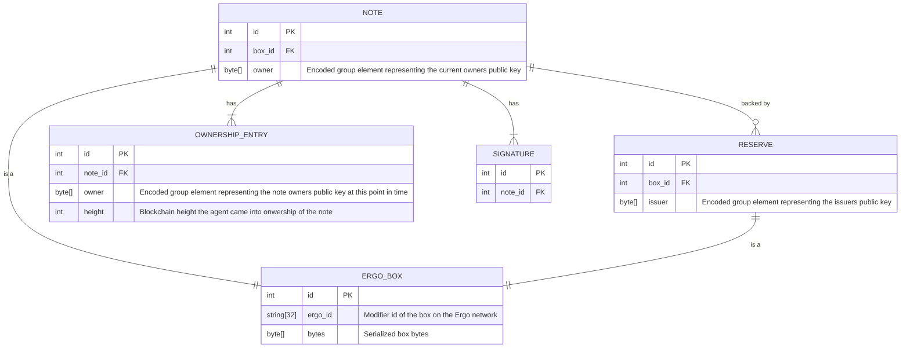

## Data Model

Below is a diagram of the data model used for the chaincash server.

```mermaid
erDiagram
    NOTE {
        int id PK
        int box_id FK
        byte[] owner "Encoded group element representing the current owners public key"
    }
    RESERVE {
        int id PK
        int box_id FK
        byte[] issuer "Encoded group element representing the issuers public key"
    }
    ERGO_BOX {
        int id PK
        string[32] ergo_id "Modifier id of the box on the Ergo network"
        byte[] bytes "Serialized box bytes"
    }
    OWNERSHIP_ENTRY {
        int id PK
        int note_id FK
        byte[] owner "Encoded group element representing the note owners public key at this point in time"
        int height "Blockchain height the agent came into onwership of the note"
    }
    SIGNATURE {
        int id PK
        int note_id FK
    }
    NOTE ||--o{ RESERVE : "backed by"
    NOTE ||--|{ OWNERSHIP_ENTRY : "has"
    NOTE ||--|{ SIGNATURE : "has"
    NOTE ||--|| ERGO_BOX : "is a"
    RESERVE ||--|| ERGO_BOX : "is a"
```
