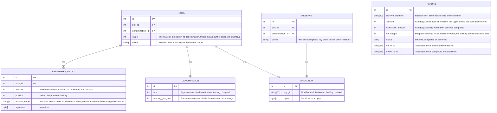

## Data Model

Below is a diagram of the data model used for the chaincash server.

`REFUND` is deliberately not a foreign key onto `RESERVE`: a reserve row is deleted as soon as its
box is spent, and the refund history has to outlive it. The reserve box carries the *pending*
refund in its registers (R5 initiation height, R6 announced amount) and the contract treats that as
the source of truth; the table adds the history the chain no longer keeps once a refund is settled.
